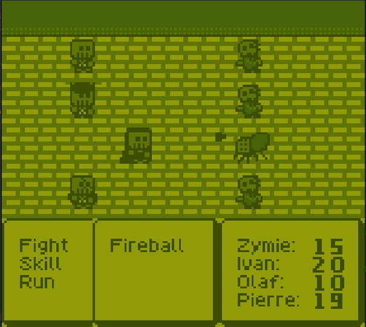

# Skeleton Crew

A micro RPG for the Gameboy, developed for [GB Compo 2023](https://itch.io/jam/gbcompo23)!

If you just want to download and play the game, you can do so on the itch.io page: https://staticlinkage.itch.io/skeleton-crew 

## Credits

Thanks to Nikku4211 for the music, hUGEDriver for the audio driver, and toxa for his vwf library which are used in this project. Other code/art assets were produced myself.

## The game

Skeleton Crew implements only the bare essentials of an RPG: exploring a dungeon, fighting monsters, and levelling up. Your objective is simply to reach the boss at the end of the dungeon and defeat him. The dungeon is not very long but your progress can be saved by resting at the fountains spread throughout, which also act as your heal points. Go fight them monsters so you can build up the strength to defeat the boss!

## Re: code quality

Please note that while I've done what I can to keep this project clean and performant, I'm not a Gameboy expert and there are likely various things that could be improved upon. Some parts of the code, namely those written towards the end of the jam, are sloppily done, but I like to think that the rest of the code is decent.

## Building

This project was written using GBDK 4.1.1, and may use some functions marked deprecated in 4.2.0. This may cause issues in future versions but I believe they could be addressed with some fairly minor updates.

The whole project can be built using `make`, but you will likely need to specify your own GBDK_HOME value corresponding to where GBDK is installed on your system, like so: `make GBDK_HOME=<path-to-gbdk>`. Once `make` completes there should be a `skeleton-crew.gb` in the `build` folder that you can open in your favourite emulator.

A `make run` command is also provided to automatically open the built ROM in Emulicious, but this relies on both Java and Emulicious being on your system. You could runthe game this way using `make run GBDK_HOME=<path-to-gbdk> JAVA=<path-to-java> EMULICIOUS=<path-to-emulicious-jar>`.
